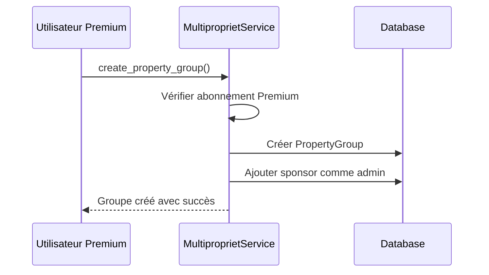
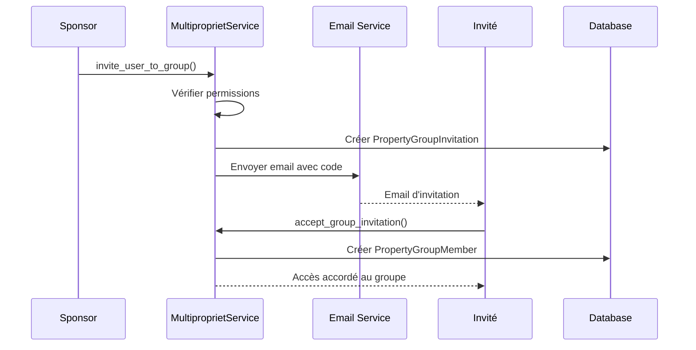
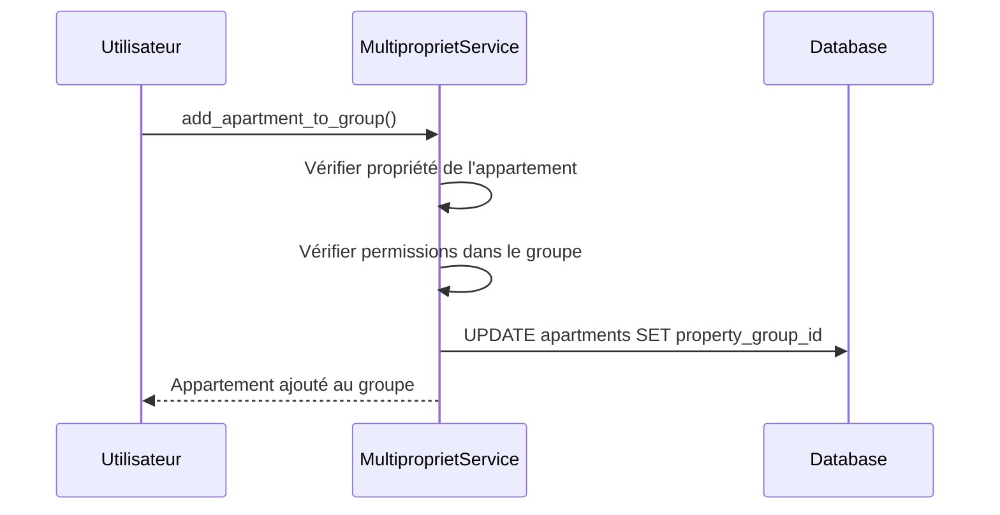

# Système de Multipropriété LocAppart

## Vue d'ensemble

Le système de multipropriété permet aux utilisateurs Premium de créer des groupes de propriété partagée (SCI, famille, investissement) et d'inviter d'autres utilisateurs à accéder à leurs appartements. Cela résout le problème des limitations d'abonnement tout en maintenant un modèle économique viable.

## Concept Clé

### Principe de Sponsoring
- Un utilisateur **Premium** peut créer des groupes de multipropriété
- Il devient le **sponsor** du groupe et paie pour tous les appartements du groupe
- Il peut inviter des utilisateurs **gratuits** ou **Premium** dans son groupe
- Les appartements du groupe comptent sur le quota **illimité** du sponsor Premium
- Les membres du groupe accèdent gratuitement aux appartements partagés

### Quotas et Limites

#### Utilisateur Gratuit
```
✅ Appartements personnels: 3 max
✅ Accès groupes multipropriété: Illimité (gratuit)
❌ Création de groupes: Interdit
❌ Sponsoring: Interdit
```

#### Utilisateur Premium
```
✅ Appartements personnels: Illimité
✅ Appartements dans ses groupes: Illimité (payés par lui)
✅ Accès groupes d'autres: Illimité (gratuit)
✅ Création de groupes: Illimité
✅ Sponsoring d'utilisateurs: Illimité
```

## Architecture Technique

### Modèles de Données

#### PropertyGroup
```sql
CREATE TABLE property_groups (
    id INT PRIMARY KEY AUTO_INCREMENT,
    name VARCHAR(200) NOT NULL,
    description TEXT,
    group_type ENUM('SCI', 'FAMILY', 'INVESTMENT', 'OTHER'),
    sponsor_id INT NOT NULL,  -- Utilisateur Premium qui paie
    group_status ENUM('ACTIVE', 'SUSPENDED', 'DISSOLVED'),
    max_members INT DEFAULT 10,
    auto_accept_invitations BOOLEAN DEFAULT FALSE,
    created_at DATETIME,
    updated_at DATETIME,
    
    FOREIGN KEY (sponsor_id) REFERENCES user_auth(id)
);
```

#### PropertyGroupMember
```sql
CREATE TABLE property_group_members (
    id INT PRIMARY KEY AUTO_INCREMENT,
    group_id INT NOT NULL,
    user_id INT NOT NULL,
    membership_status ENUM('PENDING', 'ACTIVE', 'SUSPENDED', 'LEFT'),
    role_in_group VARCHAR(50) DEFAULT 'member',
    can_invite_members BOOLEAN DEFAULT FALSE,
    can_manage_apartments BOOLEAN DEFAULT FALSE,
    can_view_finances BOOLEAN DEFAULT FALSE,
    invited_by_id INT,
    joined_at DATETIME,
    left_at DATETIME,
    
    FOREIGN KEY (group_id) REFERENCES property_groups(id),
    FOREIGN KEY (user_id) REFERENCES user_auth(id),
    FOREIGN KEY (invited_by_id) REFERENCES user_auth(id),
    UNIQUE KEY unique_group_user (group_id, user_id)
);
```

#### Extension du modèle Apartment
```sql
ALTER TABLE apartments 
ADD COLUMN property_group_id INT NULL,
ADD FOREIGN KEY (property_group_id) REFERENCES property_groups(id);
```

### Services Métier

#### MultiproprietService
- **Gestion des quotas** : Calcul intelligent selon le type d'abonnement
- **Création de groupes** : Validation des permissions Premium
- **Gestion des invitations** : Système de codes temporaires
- **Gestion des appartements** : Ajout/retrait dans les groupes

#### SubscriptionService
- **Vérification Premium** : Validation des abonnements actifs
- **Calcul des limites** : Quotas selon le type d'utilisateur
- **Surveillance** : Suspension automatique si Premium expiré

## Flux Fonctionnels

### 1. Création d'un Groupe de Multipropriété



### 2. Invitation d'un Membre



### 3. Ajout d'Appartement au Groupe



## Exemples d'Usage

### Cas 1: Famille avec Patrimoine Immobilier

**Contexte**: 
- Grand-père Premium avec 10 appartements
- 3 enfants utilisateurs gratuits
- Chacun peut gérer quelques appartements

**Solution**:
```
1. Grand-père crée groupe "Famille Dupont"
2. Ajoute 7 appartements au groupe (garde 3 personnels)
3. Invite ses 3 enfants dans le groupe
4. Chaque enfant peut:
   - Accéder aux 7 appartements du groupe
   - Avoir 3 appartements personnels gratuits
   - Total: 10 appartements accessibles chacun
```

### Cas 2: SCI d'Investissement

**Contexte**:
- Investisseur principal Premium
- 5 co-investisseurs utilisateurs gratuits
- Portefeuille de 15 biens

**Solution**:
```
1. Investisseur principal crée groupe "SCI Immobilier Plus"
2. Ajoute les 15 biens au groupe
3. Invite les 5 co-investisseurs
4. Chaque co-investisseur:
   - Accède aux 15 biens du groupe
   - Peut avoir ses 3 biens personnels
   - Total: 18 biens accessibles
```

### Cas 3: Gestionnaire Professionnel

**Contexte**:
- Gestionnaire Premium avec clients multiples
- Clients propriétaires particuliers
- Gestion déléguée

**Solution**:
```
1. Gestionnaire crée groupe par client
2. Client ajoute ses biens au groupe du gestionnaire
3. Gestionnaire gère tous les biens
4. Client garde accès en lecture
5. Facturation centralisée sur le Premium du gestionnaire
```

## APIs Disponibles

### Groupes
```http
POST   /api/multipropriete/groups              # Créer groupe
GET    /api/multipropriete/groups              # Lister mes groupes
GET    /api/multipropriete/groups/{id}         # Détails groupe
PUT    /api/multipropriete/groups/{id}         # Modifier groupe
DELETE /api/multipropriete/groups/{id}         # Supprimer groupe
```

### Membres
```http
GET    /api/multipropriete/groups/{id}/members           # Lister membres
POST   /api/multipropriete/groups/{id}/invite            # Inviter membre
PUT    /api/multipropriete/members/{id}                  # Modifier membre
DELETE /api/multipropriete/members/{id}                  # Exclure membre
```

### Invitations
```http
GET    /api/multipropriete/invitations/received          # Mes invitations
POST   /api/multipropriete/invitations/respond           # Répondre invitation
GET    /api/multipropriete/invitations/sent              # Invitations envoyées
```

### Appartements
```http
POST   /api/multipropriete/groups/{id}/apartments        # Ajouter appartement
DELETE /api/multipropriete/apartments/{id}/group         # Retirer appartement
GET    /api/multipropriete/my-apartments                 # Tous mes appartements
```

### Tableau de Bord
```http
GET    /api/multipropriete/dashboard                     # Tableau de bord complet
GET    /api/multipropriete/groups/{id}/statistics        # Stats du groupe
```

## Sécurité et Permissions

### Matrice des Permissions

| Action | Sponsor | Admin Groupe | Membre | Propriétaire Appt |
|--------|---------|--------------|--------|-------------------|
| Voir groupe | ✅ | ✅ | ✅ | ❌ |
| Modifier groupe | ✅ | ❌ | ❌ | ❌ |
| Inviter membres | ✅ | ✅* | ❌ | ❌ |
| Ajouter appartement | ✅ | ✅* | ❌ | ✅ |
| Retirer appartement | ✅ | ✅* | ❌ | ✅ |
| Voir finances | ✅ | ✅* | ✅* | ❌ |
| Dissoudre groupe | ✅ | ❌ | ❌ | ❌ |

*Si autorisé par le sponsor

### Contrôles de Sécurité

1. **Vérification Premium** : Seuls les Premium peuvent sponsoriser
2. **Suspension automatique** : Groupe suspendu si sponsor perd Premium
3. **Audit logging** : Toutes les actions tracées
4. **Rate limiting** : Protection contre les invitations spam
5. **Codes temporaires** : Invitations avec expiration

## Configuration et Déploiement

### Migration Base de Données
```bash
cd backend
python migrate_multipropriete.py
```

### Variables d'Environnement
```env
# Limites multipropriété
MAX_GROUPS_PER_PREMIUM_USER=50
MAX_MEMBERS_PER_GROUP=20
INVITATION_EXPIRY_DAYS=7

# Notifications
SEND_GROUP_INVITATIONS=true
SEND_GROUP_ACTIVITY_NOTIFICATIONS=true
```

### Intégration dans main.py
```python
from multipropriete_routes import router as multipropriete_router

app.include_router(multipropriete_router)
```

## Monitoring et Métriques

### KPIs à Surveiller
- Nombre de groupes créés par mois
- Taux d'acceptation des invitations
- Appartements moyens par groupe
- Conversion gratuit → Premium via groupes

### Alertes
- Tentatives de contournement des quotas
- Pic d'invitations (spam potentiel)
- Groupes avec sponsor Premium expiré

## Évolutions Futures

### Phase 2 - Fonctionnalités Avancées
- **Rôles personnalisés** : Définition de rôles métier spécifiques
- **Sous-groupes** : Hierarchie de groupes pour grandes organisations
- **Templates de groupes** : Modèles pré-configurés par secteur
- **Analytiques avancées** : Rapports de performance par groupe

### Phase 3 - Intégrations
- **Comptabilité** : Export des données financières par groupe
- **Notifications push** : Alertes temps réel sur activité groupe
- **API publique** : Intégration avec systèmes tiers
- **Mobile app** : Application dédiée multipropriété

## Support et Dépannage

### Problèmes Courants

**Q: Un utilisateur gratuit ne peut pas accéder aux appartements du groupe**
R: Vérifier que:
- Le groupe est ACTIVE
- Le sponsor a un abonnement Premium actif
- L'utilisateur a accepté l'invitation
- Les appartements sont bien dans le groupe

**Q: Impossible d'ajouter un appartement au groupe**
R: Vérifier que:
- L'utilisateur est propriétaire de l'appartement
- L'appartement n'est pas déjà dans un autre groupe
- L'utilisateur a les permissions dans le groupe

**Q: Le groupe est suspendu**
R: Le sponsor n'a plus d'abonnement Premium actif. Il doit renouveler son abonnement.

### Commandes de Debug
```bash
# Vérifier les quotas d'un utilisateur
python -c "
from services.multipropriete_service import MultiproprietService
from database import SessionLocal
db = SessionLocal()
quotas = MultiproprietService.get_user_apartment_quotas(db, USER_ID)
print(quotas)
"

# Lister les groupes d'un utilisateur
python -c "
from models_multipropriete import PropertyGroup
from database import SessionLocal
db = SessionLocal()
groups = db.query(PropertyGroup).filter(PropertyGroup.sponsor_id == USER_ID).all()
for g in groups: print(f'{g.name}: {g.group_status}')
"
```

## Conclusion

Le système de multipropriété de LocAppart offre une solution élégante aux limitations d'abonnement tout en préservant le modèle économique. Il permet aux utilisateurs Premium de partager leurs quotas illimités avec des utilisateurs gratuits, créant un écosystème collaboratif autour de la gestion immobilière.

Les cas d'usage couvrent les besoins familiaux, professionnels et d'investissement, avec une architecture technique robuste et sécurisée qui s'intègre naturellement dans l'application existante.